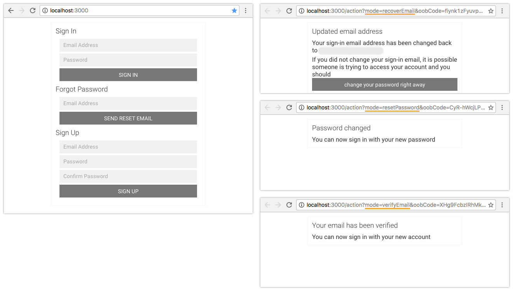
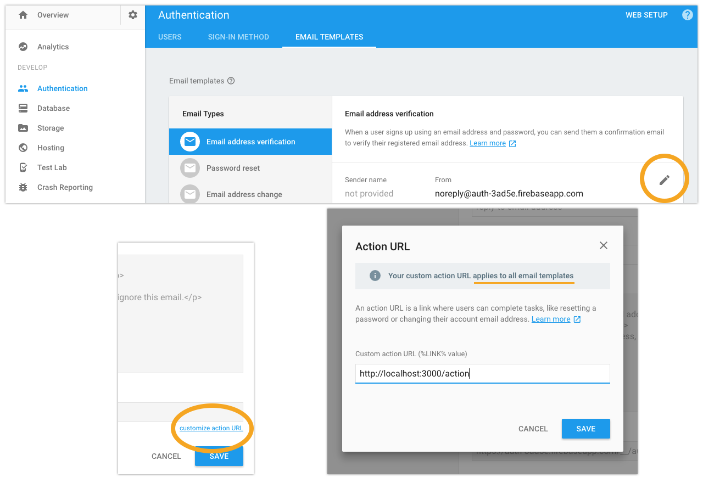

---

If you are using Email and Password Authentication with Firebase then you will need to provide custom email action handlers.
You can find out more about custom email action handlers in the Firebase docs [here](https://firebase.google.com/docs/auth/custom-email-handler).
Use this repository as a blueprint to pick out the code you need to integrate into your application.

## To Run Locally

```bash
$ cd ~/Desktop
$ git clone https://github.com/griffinsockwell/react-firebase-custom-email-handlers.git
```

Make sure [Node.js](https://nodejs.org/) is installed.

Login to [Firebase](https://console.firebase.google.com/) and create a new app from the dashboard.

Click on 'Add Firebase to your web app'

Change the firebase config in '/src/reference.js'

```js
firebase.initializeApp(<your-config-object-here>);
```

In the firebase dashboard. Enable an Authentication Sign-In Method with Email/Password and then click Save.

Now you will need to change the URL for the email templates. Click the pencil icon to edit the template, then click customize action URL, and finally update the URL to http://localhost:3000/action and click save. Changing the URL in one template will update the other templates.



Change into the correct directory.
```bash
$ cd react-firebase-custom-email-handlers
```

Install the node modules.
```bash
$ npm install
```

Start the development server.
```bash
$ npm start
```

The Action URL can be whatever you want it to be for your application. You just need to handle the queries in the URL. Take a look at '/src/components/Action.js' to see how it is handling the queries.
